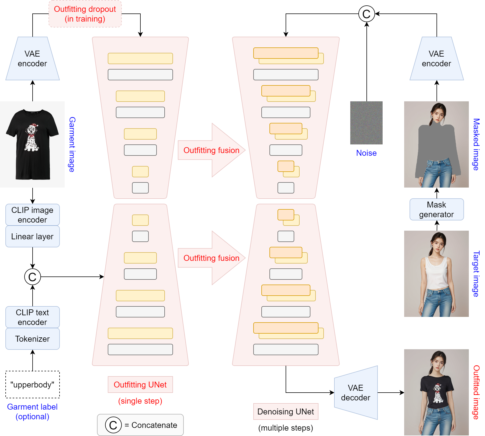

# WearCast
This repository is the official implementation of WearCast

🤗 [Try out WearCast](https://huggingface.co/spaces/levihsu/WearCast)


(Thanks to [ZeroGPU](https://huggingface.co/zero-gpu-explorers) for providing A100 GPUs)

<!-- Or [try our own demo](https://wearcast.ibot.cn/) on RTX 4090 GPUs -->

> **WearCast: High-Fidelity Men's Half-Body Virtual Try-On Based on Latent Diffusion**<br>
> A highly optimized pipeline tailored specifically for Men's half-body clothing outfitting.

Our model checkpoints trained on [VITON-HD](https://github.com/shadow2496/VITON-HD) (half-body) have been released

* 🤗 [Hugging Face link](https://huggingface.co/levihsu/WearCast) for ***checkpoints*** (wearcast, humanparsing, and openpose)
* 📢📢 We support ONNX for [humanparsing](https://github.com/GoGoDuck912/Self-Correction-Human-Parsing) now. Most environmental issues should have been addressed : )
* Please also download [clip-vit-large-patch14](https://huggingface.co/openai/clip-vit-large-patch14) into ***checkpoints*** folder
* We've only tested our code and models on Linux (Ubuntu 22.04)

&nbsp;
&nbsp;

## Installation
1. Clone the repository

```sh
git clone https://github.com/levihsu/WearCast
```

2. Create a conda environment and install the required packages

```sh
conda create -n wearcast python==3.10
conda activate wearcast
pip install torch==2.0.1 torchvision==0.15.2 torchaudio==2.0.2
pip install -r requirements.txt
```

## Quick Start (Gradio UI)
To launch the interactive Men's Virtual Try-On interface locally:
```sh
cd run
python gradio_wearcast.py
```
Open `http://localhost:7865` in your browser!

## Command Line Inference
1. Men's Half-body model

```sh
cd run
python run_wearcast.py --model_path <model-image-path> --cloth_path <cloth-image-path> --scale 2.0 --sample 4
```


## Citation
```
@article{xu2024wearcast,
  title={WearCast: Outfitting Fusion based Latent Diffusion for Controllable Virtual Try-on},
  author={Xu, Yuhao and Gu, Tao and Chen, Weifeng and Chen, Chengcai},
  journal={arXiv preprint arXiv:2403.01779},
  year={2024}
}
```

## Star History

[](https://star-history.com/#levihsu/OOTDiffusion&Date)

## TODO List
- [x] Paper
- [x] Gradio demo
- [x] Inference code
- [x] Model weights
- [ ] Training code
